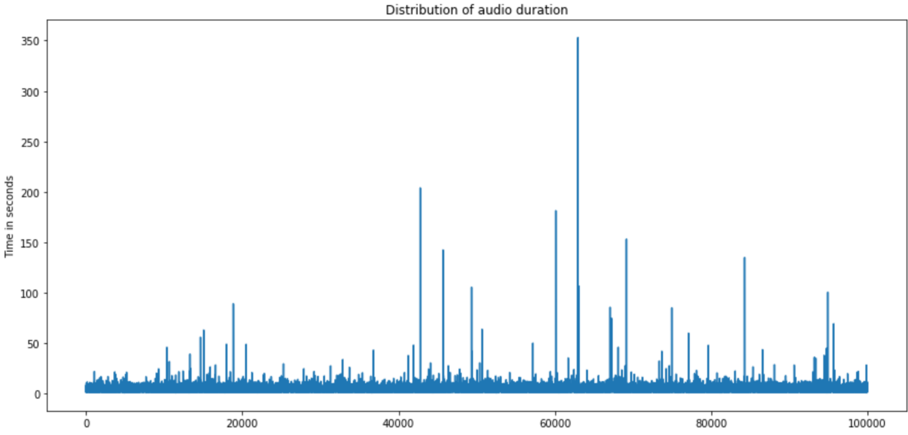
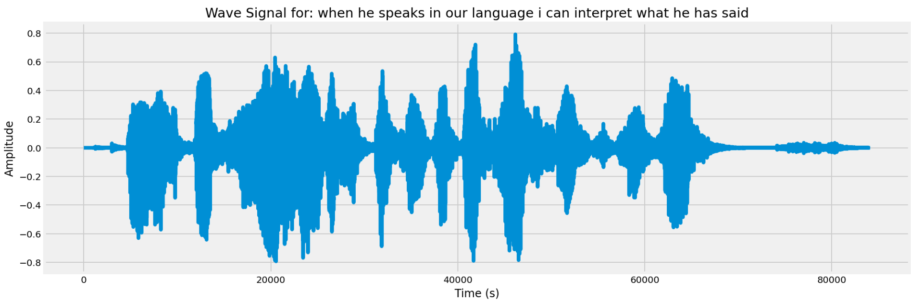
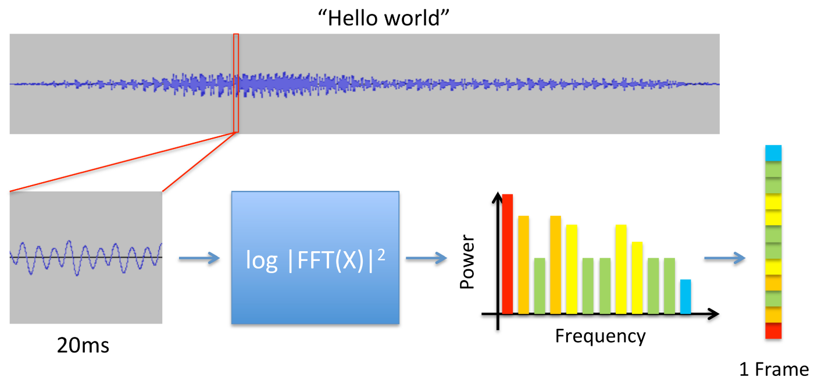
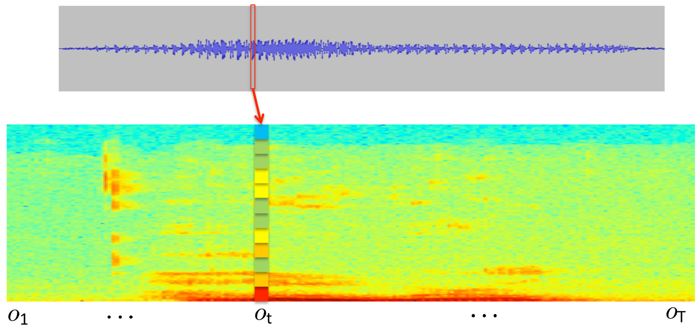
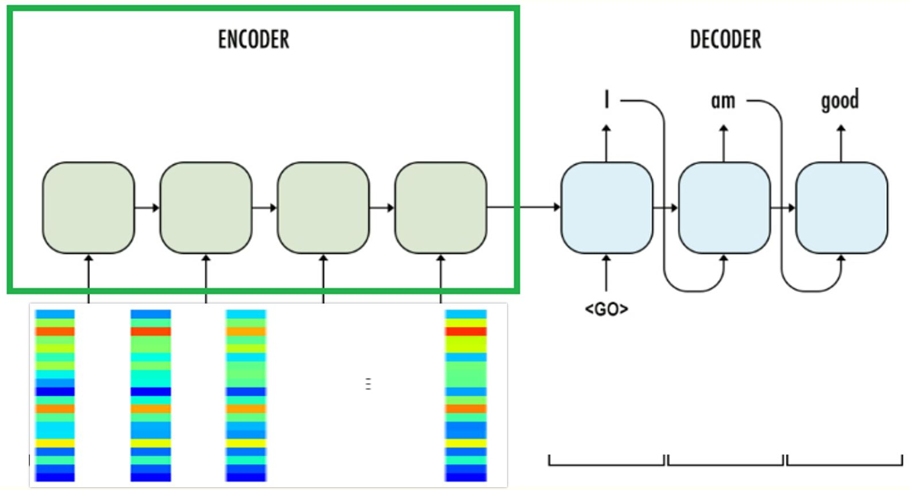
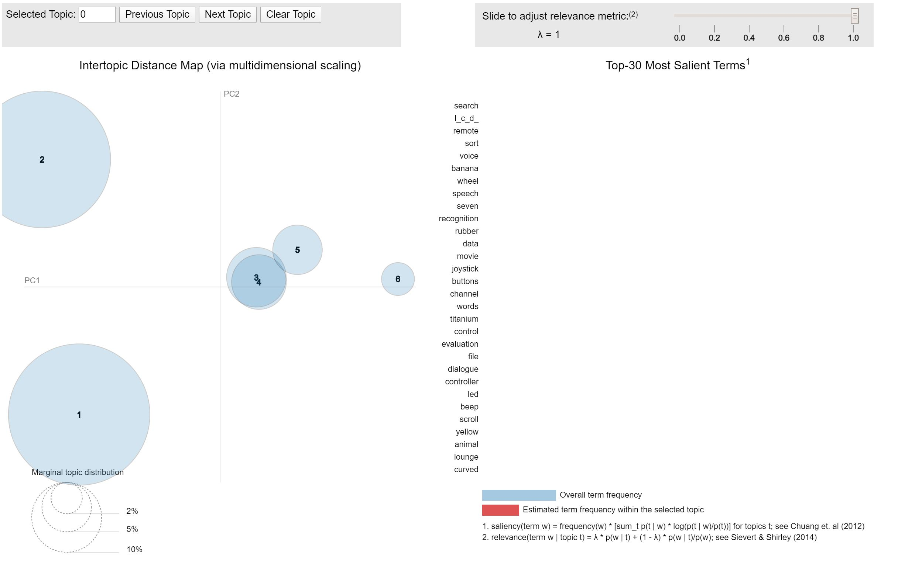

#  Capstone: Automatically-Generated Meeting Minutes

## Introduction
In business meetings, participants usually exchange ideas and make decisions. Therefore, it’s important to keep and analyze meetings content to enhance efficiency. To achieve such efficiency, one could use artificial intelligence techniques to automatically convert recorded meetings to text then apply some natural language processing such as topic modeling to extract important information. 

----------------------------------------------------------------------------------------------------------

## Approach
One approach to solve this problem is to build two models 
- **Speech Recognition** which is used to convert audio clips to text
- **Natural Language Processing (NLP)** which is used to analyze the text to extract important information

----------------------------------------------------------------------------------------------------------

## Dataset

### Speech Recognition dataset
Common Voice is a corpus of speech data read by users on the Common Voice website. The dataset is divided into three subsets valid, invalid and other. 
- **Valid subset:** checked at least by two annotators and the majority said the audio matches the text 
- **Invalid subset:** checked at least by two annotators and the majority said the audio does not matches the text 
- **Other subset:** checked by less than two annotators or there is no majority vote

|  **Column**	| **Description** |
| --- | --- |
|**filename** |Relative path of the audio file |
|**text** |Supposed transcription of the audio |
|**up_votes** |Number of people who said audio matches the text |
|**down_votes** |Number of people who said audio does not match text |
|**age** |Age of the speaker |
|**gender** |Gender of the speaker |
|**accent** |Accent of the speaker |
|**duration** |Duration of the audio |

- Dataset Link: https://www.kaggle.com/mozillaorg/common-voice

### Natural Language Processing transcripts
133 meeting transcriptions form AMI Corpus

- Dataset Link: http://groups.inf.ed.ac.uk/ami/corpus/annotation.shtml

----------------------------------------------------------------------------------------------------------

## Preprocessing and Feature Extraction: 

### Audio Length Distribution
As shown in the figure below,  most of the audio clips length are approximately the same; however, there are some outliers which are removed from the dataset since it will make the size of the matrix unreasonably large 

### Raw Wave Signal
Here is an example of a raw audio signal from the dataset 

### MFCC Features
Unfortunately, it is difficult to use raw audio signal directly in speech recognition, therefore I had to transform the raw signal to something called MFCC features which is a representation of the audio clip that approximates the human auditory system's response. The idea here is to divide the audio clip into small chunks approximately 20 ms and convert them to frequency domain using the following equation to convert to images as shown in the two figures below.
as you can see here

                                                      Figure 1

                                                      Figure 2

----------------------------------------------------------------------------------------------------------

## Modeling: 
### Speech Recognition
#### Sequence to Sequence: 
For the speech recognition model I use sequence to sequence network as shown below. The encoder decoder diagram which is basically two LSTM layers. The encoder takes the mfcc feature as input and procees them sequentially and generate output and hidden state. These hidden state will become the initial state for the the decoder which takes the transcript as input and the output of this decoder will the next character of the input transcript.

#### Results

|  	| **Training set ** |**Validation set** |
| --- | --- | --- |
|**Accuracy**|0.2356|0.2314|
|**Loss**  	|0.0980|0.1159 |

### Natural Language Processing 
#### Topic modeling
An lda topic model is applied to discover the most important topic in the transcript of meetings

